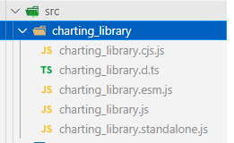
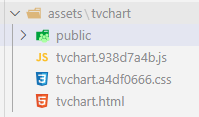

# Flutter Charting Library 

This is how to add charting_library to your flutter application with JS api.
The repo contains 2 projects, flutter project and js project.
Before starting, read prerequisite.

# Prerequisite

- Flutter 2.0 or newer
- Access to charting_library v19.x (or newer)
- (IMPORTANT) Knowledge on how to use charting_library on web

# Step to build

## Bundling charting_library

First you need to bundle charting_library as a single page web.
You can use your own bundler/way. But if you need quick you can use method this example use:

1. Grab these files and put it on `src/charting_library`



2. Run build script `npm run build`
3. Bundled files should be in dist folder

## Add charting_library to flutter

This example is using `flutter_inappwebview` for WebView and localhost, to serve webpage directly from assets folder. You can use other WebView packages/serve via server, if you wish.
For this example follow this method:

1. Grab the dist files from step before
2. Create folder `assets/tvchart`, and paste those files.
3. Create folder `assets/tvchart/public`, and paste all files charting_library needed (the one needed from library_path). This is assets folder should like right now.



4. Add folder to your `pubspec.yaml` assets list, you need to specify all subfolder as well check example `pubspec.yaml`.
5. Run flutter app on your devices.


## (Optional) Adding new types/class

If you needed types/class that doesn't exist yet on `tvchart_types.dart` you can check the typedef (.d.ts files) on charting_library and try to add an equivalent class to `tvchart_types.dart`, and then add `toJson` and `fromJson` function (see other class as example).
After that run build_runner to generate new/updated `JsonSerializable` annotated class. You can run it using vscode tasks `Run build_runner` or with terminal command
```
